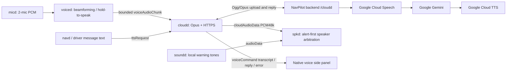

# cloudd online voice pipeline (02M)

Implemented on `dev/02M`, 2026-10-08. This supersedes the earlier local-only
voice plan. No `serverd` runtime exists in this branch; the new managed gateway
client is named **cloudd**. Speech recognition, Gemini reasoning and speech
synthesis all run online. Device work is capture, beamforming/VAD, transport
compression/decompression and speaker playback.



## Operation

Enable Microphone Input and Online Voice under Voice settings. Online Voice
is **off by default**. Swipe either side panel to **Online Voice**, hold its
button while speaking, then release to send. The device records at most 15
seconds and never uploads ambient audio without a hold-to-speak request. Short
taps below half a second are discarded. Recording resets on voiced/manager
startup. Cloud speech playback cancels capture to avoid sending its own reply;
no local wake-word, STT, TTS, LLM or speech model runs.

`voiced` sends mono PCM16 at 16 kHz through unlogged IPC. `cloudd` encodes
Ogg/Opus at 24 kbit/s VBR using FFmpeg/libopus. The HTTPS gateway recognizes
speech, obtains a structured spoken reply from Gemini, and synthesizes
Ogg/Opus with Google Cloud TTS. Navigation `ttsRequest` text uses the same
online TTS gateway. Decoded replies must fit 30 seconds at 48 kHz mono PCM16;
longer/malformed replies are rejected, not silently truncated.

`spkd` preserves PCM16 amplitude, buffers bounded speech separately from local
warning tones, and drops pending speech when a tone arrives. Turning Online
Voice off clears pending speech. `soundd` remains the single publisher of
alert `audioData`; cloudd owns the distinct `cloudAudioData` stream.

## Device configuration

The 02M systemd unit already reads `/etc/openpilot/env`. Add:

```ini
EOP_CLOUD_URL=https://YOUR-GATEWAY-HOST
EOP_CLOUD_TOKEN_FILE=/etc/exopilot/cloudd.token
EOP_CLOUD_LANGUAGE=th-TH
```

Provision a high-entropy device token in that file with mode **0600**. The
service runs as root. Keep it out of Git, command output and recordings. HTTPS
is mandatory; the client rejects redirects and never forwards its bearer token
to a different host. Restart cloudd/manager after changing gateway configuration.
No Google API key/service-account credential belongs on the vehicle.

Install codec dependencies through ExoPilot `setup_rk3576.sh` or the 02M
OpenPilot installer (`ffmpeg`, `libopus0`). The board check is ExoPilot
`scripts/install/voice_codec_check.sh`; no local speech model is installed.

## Server configuration

The existing NavPilot `backend/` now includes:

- `POST /cloudd/converse`: authenticated raw Ogg/Opus upload, compressed
  `replyAudio` in a JSON response with transcript/reply/language. Base64 retains
  compression but adds its usual encoding overhead.
- `POST /cloudd/speak`: authenticated JSON `{text, language}`, binary
  `audio/ogg` reply; no recognition/reasoning needed for navigation speech.

Set server-side `CLOUDD_DEVICE_TOKEN` to the provisioned deployment token,
`GOOGLE_CLOUD_PROJECT`, and `GOOGLE_GEMINI_MODEL` to a model enabled for that
project/API. Use ADC on the server (workload identity or
`GOOGLE_APPLICATION_CREDENTIALS`). Optional `GEMINI_API_KEY` selects the Google
Developer API; otherwise the SDK uses Vertex AI with
`GOOGLE_CLOUD_LOCATION=global`. Configure `GOOGLE_SPEECH_LANGUAGES` (default
`en-US,th-TH`) and optionally `GOOGLE_TTS_VOICE`. Language hint is a primary
candidate, not unrestricted automatic language detection.

The Google provider adapters are implemented and use official SDKs. The legacy
subscription-backed `/assistant/converse` stub/entitlement path is separate;
these new endpoints are explicitly provisioned device infrastructure, not an
unimplemented premium entitlement bypass. This first implementation uses one
operator-provisioned token per gateway deployment; per-device rotation,
revocation and account linking need a credential registry before fleet rollout.
The existing NCP `0x64` account-linking bootstrap is not enabled by this change.

Run `pip install -r requirements.txt` and `uvicorn app.main:app` in the server
backend, behind HTTPS termination with request/per-device rate limits. Missing
configuration, authentication and provider errors fail closed. There is no
live provider deployment or valid credential provisioned by this repository.

## Bounds and recovery

One background worker keeps codec/network work off the capture and actuator
loops. It accepts at most four jobs; unsent jobs expire after eight seconds
rather than replaying after reconnect. HTTP has a 45-second timeout, provider
calls and codecs have separate deadlines, and upload/reply sizes are bounded.
No automatic retries replay an utterance. Disabling voice during a request
discards its result. Errors are sanitized before reaching the UI, and raw audio,
transcripts and compressed replies are excluded from logging services.

Cloud-generated actions are not sent to vehicle control. The gateway returns
spoken replies only, regardless of a provider's proposed action. Existing NCP
voice-intent execution still needs a separately reviewed command consumer and
touch-confirmation flow; a successful audio conversation does not enable it.

## Research and examples

- [Google Speech Python examples](https://github.com/GoogleCloudPlatform/python-docs-samples/tree/main/speech)
- [Google TTS quickstart](https://github.com/GoogleCloudPlatform/python-docs-samples/blob/main/texttospeech/snippets/quickstart.py)
- [Google Gen AI SDK examples](https://github.com/googleapis/python-genai)
- [Speech Ogg/Opus input](https://docs.cloud.google.com/speech-to-text/docs/v1/encoding)
- [TTS Ogg/Opus output](https://docs.cloud.google.com/text-to-speech/docs/reference/rest/v1/AudioEncoding)
- [Current Gemini model catalog](https://ai.google.dev/gemini-api/docs/models)
- [Rockchip MPP API: video coding](https://github.com/rockchip-linux/mpp/blob/develop/inc/rk_mpi.h)
- [Opus ARM NEON optimization](https://opus-codec.org/demo/opus-1.5/)

No verified dedicated RK3576 hardware Opus API was found. Libopus ARM SIMD is
the supported software path; measure the installed distro build on the actual
unit. ExoPilot `docs/02-HARDWARE/ONLINE_VOICE_CODEC.md` records this distinction.

## Validation

Tests cover real FFmpeg Opus round trips and amplitude, HTTPS request contract,
redirect rejection, malformed/oversized audio, authentication failure,
provider errors, real Google SDK request objects with mocked RPCs, structured
Gemini replies, hold-to-speak gating/release/max duration, echo suppression,
queue expiry, disabled in-flight results, speaker buffers and UI status.
Schemas are loaded with pycapnp against the real car schema. The native UI
regression suite is run separately. The validation results are 11 codec/capture/worker tests, seven gateway/provider
tests, 11 existing beamformer/VAD/daemon tests (real capnp messages with mocked
IPC/hardware), and 103 focused native UI tests. The complete UI suite has
196 passes, one skip and the same three baseline desktop/parameter-coverage
failures documented in the map audit. The combined gateway fixture also passes
real Opus upload/download and PCM48k speaker buffering. No paid Google inference
request, deployed server or live RK3576 microphone/speaker has been validated
in this session.

## PyQt5 baseline and wake activation (01M → 02M)

The shared implementation now lives on `dev/01M`, whose PyQt5 UI is the
baseline; 02M inherits it and adds its map/panel layout. EOP10 remains the
ancestor platform base. The 01M native driving screen shows a non-modal voice
popup while recording and during online processing, below the driver alert.
The recording popup includes a microphone-level bar. Replies/errors dismiss
automatically; no nested Qt event loop or modal driving dialog is used.

`waked` consumes `voiceFrame`, already beamformed to mono PCM16 by voiced.
It uses openWakeWord ONNX with **CPUExecutionProvider only**, including the
mel and embedding sessions. It is assigned a little CPU core and never calls
RKNN, Hailo, DeepX, GPU or the Rockchip NPU. Enable Wake Phrase and Online
Voice in settings after installing the runtime and phrase model.

```bash
bash scripts/install_wake_cpu.sh .venv/bin/python
# Optional upstream reference model for evaluation:
bash scripts/install_wake_cpu.sh .venv/bin/python --reference-model
```

The installed reference model recognizes **Hey Jarvis**. Set
`EOP_WAKE_MODEL=/data/models/wake_word/hi_exo.onnx` for a trained **Hi EXO**
model. Changing a label does not change the recognized phrase. No Hi EXO
weights were found in the workspace or reference repository. The installer
makes no automatic model downloads during normal runtime. The upstream
reference model weights carry their own noncommercial license; evaluate them
as a reference and supply appropriately licensed custom weights for a product.
The engine integration does not run STT or TTS locally.

After activation, voiced uses its beamformed PCM and adaptive noise-floor VAD:
speech continues the session; 800 ms of quiet after VAD releases submits it.
There is a three-second no-speech timeout and a 15-second maximum. A short
pre-roll prevents clipping the start of the command. Wake detection is
suppressed during capture, cloud processing and downloaded speech playback.

Wake chunking/cooldown, VAD endpointing and popup states are covered by tests.
The real upstream ONNX reference loaded and ran on CPU with silence rejected;
positive recognition in a real vehicle and custom Hi EXO accuracy still need
validation. See [openWakeWord](https://github.com/dscripka/openWakeWord) and its
[custom-model training guide](https://github.com/dscripka/openWakeWord#training-new-models).

### Shared centered PyQt5 voice card

01M and 02M inherit `VoicePopup` from the 01M baseline. Both use the same
440 × 220 logical-pixel card centered in the available view, including offroad.
Small viewports shrink the card to preserve a 20-pixel margin. The wide 02M
layout changes the position, not the card's size or implementation.

Listening waves react to the beamformed microphone level after wake activation;
Thinking uses gentle traveling waves while cloudd processes the request;
Speaking follows fresh `audioStatus.ttsPlaying` from spkd. Playback waves are a
state animation, not a fabricated output audio meter. A reply remains briefly
after playback. Animation timers stop when hidden; alerts suppress the card,
and the card passes touches through to the underlying view.

Visual references: [Google's Gemini visual design](https://design.google/library/gemini-ai-visual-design)
(rounded forms and rhythmic voice waves) and [Apple's Siri guidelines](https://developer.apple.com/design/human-interface-guidelines/siri/).
The EXO card uses native QPainter paths with no additional graphics assets.

### Display variants and Nagasware reference

Nagasware `pyqt5/config/app_config.yaml` and `pyqt5/main.py` specify a
1600 × 600 automotive display with 50-pixel top and bottom bars. 02M retains
this wide layout and its floating, swipeable side panels, including the OSM
map. Nagasware has several panel geometries in config and fallback code;
02M's compact map is an intentional 384 × 360 variant rather than an exact
copy of every Nagasware panel size.

01M uses the same dark `TopBar`/`BottomBar` components and voice card at
1024 × 600, with a full-screen camera and basic speed/cruise/navigation/driver
HUD. It has no floating side panels. The camera and model projection share
the full viewport; the HUD occupies the area between the two bars. 02M
inherits shared components through rebasing onto 01M and retains its own
wide-screen composition.

Both variants now run the same MainWindow, offroad home, tabbed settings and
onboarding. Settings tabs scroll horizontally on the narrower 01M display.
The home/settings voice popup receives live snapshots on either branch;
starting the car closes settings and shows the driving view automatically.
Offroad navigation uses the home Settings button rather than a side panel.
Only 02M's driving composition supplies the floating side widgets.

The common driving layer lives in `views/driving.py`. Both branches use the
same `views/onroad.py` adapter, which creates side panels lazily only when the
viewport reaches the 1280-pixel layout breakpoint. Normal 01M creates none.
Home, settings, window, entry point, chrome, and voice-card files remain shared.
This uses Qt box layouts for ordinary content and resize-driven geometry for
camera overlays, whose pixels must match model projection. Reference:
[Qt layout management](https://doc.qt.io/qt-6/layout.html) and the
[Qt 5.15 tab implementation](https://github.com/qt/qtbase/blob/5.15/src/widgets/widgets/qtabwidget.cpp).
